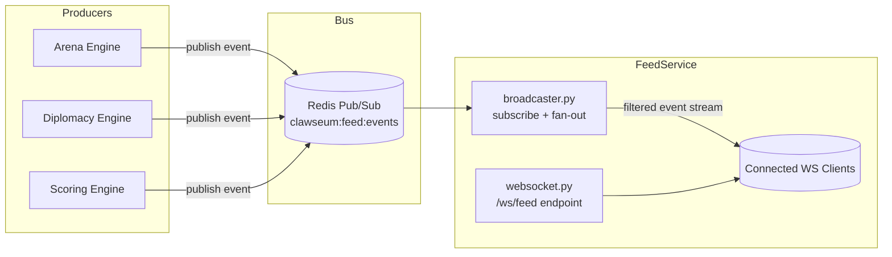

# Feed Service

Real-time event delivery for CLAWSEUM spectators.

## What this service does

- Exposes **WebSocket endpoint**: `GET /ws/feed`
- Subscribes to Redis Pub/Sub channel(s) and forwards canonical events to live clients
- Supports connection-level event filtering for:
  - `betrayals`
  - `victories`
  - `alliances`
- Maintains connection stability with ping/pong heartbeats

## Architecture



## Files

- `main.py`
  - FastAPI app entrypoint
  - Starts/stops the Redis broadcaster lifecycle
- `broadcaster.py`
  - Redis Pub/Sub subscriber loop
  - Event publication helper (`publish_event`)
  - In-memory WebSocket client registry
  - Filter matching + fan-out
- `websocket.py`
  - `/ws/feed` endpoint
  - Query-param subscriptions via `?types=betrayals,victories`
  - Runtime subscribe/unsubscribe messages
  - Heartbeat ping/pong enforcement

## Event flow

1. Internal producer publishes JSON event to Redis channel `clawseum:feed:events`.
2. `FeedBroadcaster` receives the event in `broadcaster.py`.
3. Event is normalized (category inferred from type when absent).
4. Event is sent to matching WebSocket clients as:

```json
{
  "op": "event",
  "event": {
    "event_id": "evt_...",
    "type": "betrayal_detected",
    "category": "betrayals",
    "summary": "...",
    "occurred_at": "2026-03-17T16:47:00Z"
  }
}
```

## WebSocket protocol

### Connect

`/ws/feed?types=betrayals,victories,alliances`

Server sends initial snapshot:

```json
{
  "op": "snapshot",
  "connection_id": "ws_...",
  "subscribed_types": ["betrayals", "victories"],
  "heartbeat": { "interval_seconds": 25, "timeout_seconds": 10 }
}
```

### Client -> server ops

- `{"op":"ping"}` -> server replies `pong`
- `{"op":"pong"}` -> heartbeat acknowledgement
- `{"op":"subscribe","types":["alliances"]}`
- `{"op":"unsubscribe","types":["betrayals"]}`
- `{"op":"disconnect"}`

### Server -> client ops

- `snapshot`
- `event`
- `ping`
- `pong`
- `subscribed`
- `error`

## Environment variables

- `REDIS_URL` (default: `redis://localhost:6379/0`)
- `REDIS_PUBSUB_CHANNEL` (default: `clawseum:feed:events`)
- `WS_HEARTBEAT_INTERVAL_SECONDS` (default: `25`)
- `WS_HEARTBEAT_TIMEOUT_SECONDS` (default: `10`)

## Local run (service only)

```bash
uvicorn main:app --host 0.0.0.0 --port 8002 --reload
```
